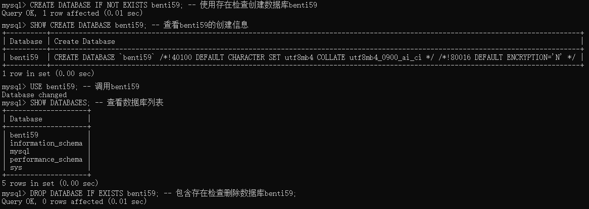
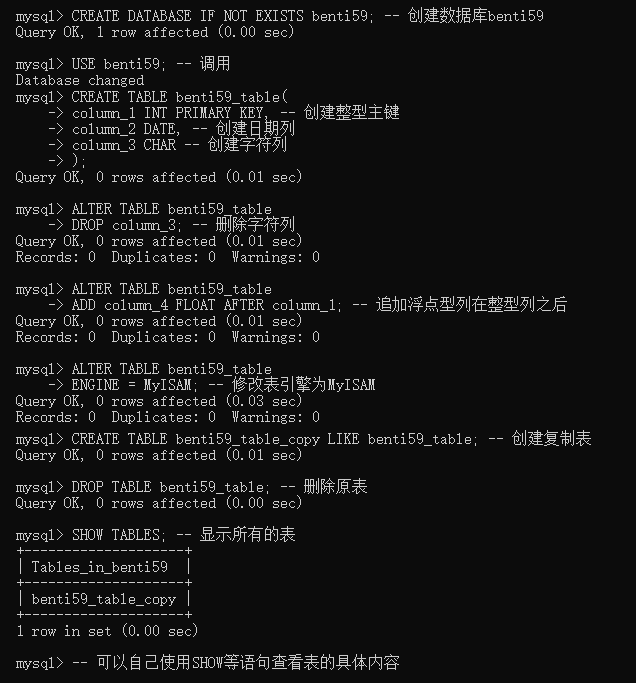

# SQL语法与示例

## SQL类型  
**定义**：结构化查询语言，包含以下特点  
- **一体化**：包含所需所有功能(DDL、DML、DQL)  
- **使用方式**：直接运用SQL语句，或嵌入高级语言  
- **非过程化**：只提问题，由系统解决问题  
- **人性化**：更贴近自然语言

****

## 类型
- **DDL(Data Definition Language)**：数据定义类语言，用于定义、修改、删除数据库中的**结构**（如数据库本身、表、索引）  
- **DML(Data Manipulation Language)**：用于对数据库表中的**记录（数据）**进行增、删、改操作  
- **DQL(Data Query Language)**：用于从数据库中**查询**和**检索**所需的数据记录  

****

## 数据定义(DDL)  
> **DDL**就像是建筑师，负责设计与建造容纳数据的库房。

**需要了解以下内容**  
- **CREATE**：用于创建对象  
- **DROP**：用于删除对象  
- **SHOW**：用于显示对象结构
- **DATABASE**：指代数据库，一般搭配以上语句使用；若使用**DATABASES**则指代多个/所有数据库  
- **TABLE**：指代表，一般搭配以上语句使用；若使用**TABLES**则指代多个/所有表  
- **ALTER**：用于修改已有对象的结构（如表结构、列属性等）

### 数据库的基本操作

> 数据库(Database)是存储数据的容器，它按照数据结构表(Table)来存储数据。本节将直接作用于数据库本身

#### 1. 创建数据库
*   **语句**： `CREATE DATABASE`
*   **语法**：
	```sql
	CREATE DATABASE [IF NOT EXISTS] <数据库名>;
	```
*   **说明**： 创建指定名称的新数据库。`IF NOT EXISTS` 为可选子句，用于避免因数据库已存在而报错。
*   **示例**：
	```sql
	-- 输入：创建数据库
	CREATE DATABASE test_db;
	-- Query OK, 1 row affected (0.01 sec)
	```
	```sql
	-- 输入：使用存在检查创建（推荐）
	CREATE DATABASE IF NOT EXISTS test_db;
	-- 输出：当数据库已存在时的安全提示
	-- Query OK, 0 rows affected, 1 warning (0.00 sec)
	```

#### 2. 查看数据库列表
*   **语句**： `SHOW DATABASES`
*   **语法**：
	```sql
	SHOW DATABASES;
	```
*   **说明**： 列出当前数据库服务器中所有的数据库名称。
*   **示例**：
	```sql
	-- 输入：查看所有数据库
	SHOW DATABASES;

	-- 输出：数据库列表
	+--------------------+
	| Database           |
	+--------------------+
	| information_schema |
	| mysql              |
	| test_db          |
	| performance_schema |
	| sys                |
	+--------------------+
	5 rows in set (0.00 sec)
	```

#### 3. 删除数据库
*   **语句**： `DROP DATABASE` **[!DANGER]**
*   **语法**：
	```sql
	DROP DATABASE [IF EXISTS] <数据库名>;
	```
*   **说明**： **该此操作不可逆，将永久删除数据库及其所有数据。** `IF EXISTS` 为可选子句，用于避免因数据库不存在而报错。
*   **示例**：
	```sql
	-- 输入：安全删除数据库
	DROP DATABASE IF EXISTS test_db;
	-- 输出：执行成功（或数据库不存在的静默成功）
	-- Query OK, 0 rows affected (0.02 sec)
	```

#### 4. 选择数据库
*   **语句**： `USE`
*   **语法**：
	```sql
	USE <数据库名>;
	```
*   **说明**： 将后续操作的默认上下文切换到指定数据库。
*   **示例**：
	```sql
	-- 输入：选择数据库
	USE test_db;
	-- 输出：切换成功
	-- Database changed
	```

#### 5. 查看数据库定义信息
*   **语句**： `SHOW CREATE DATABASE`
*   **语法**：
	```sql
	SHOW CREATE DATABASE <数据库名>;
	```
*   **说明**： 显示创建指定数据库的完整SQL语句，可用于查看其字符集、排序规则等元数据。
*   **示例**：
	```sql
	-- 输入：查看数据库定义
	SHOW CREATE DATABASE sys;
	-- 输出：创建语句详情
	+----------+-------------------------------------------------------------------------------------------------------------------------------+
	| Database | Create Database                                                                                                               |
	+----------+-------------------------------------------------------------------------------------------------------------------------------+
	| sys      | CREATE DATABASE `sys` /*!40100 DEFAULT CHARACTER SET utf8mb4 COLLATE utf8mb4_0900_ai_ci */ /*!80016 DEFAULT ENCRYPTION='N' */ |
	+----------+-------------------------------------------------------------------------------------------------------------------------------+
	1 row in set (0.03 sec)
	```

#### 综合操作示例

**题目：DDL_CREATE_1**

**要求：**
1.  创建数据库 `benti59`（需包含存在检查）。
2.  查看 `benti59` 数据库的创建信息。
3.  切换到 `benti59` 数据库。
4.  查看所有数据库列表，确认 `benti59` 存在。
5.  删除数据库 `benti59`（需包含存在检查）。

**操作结果示意：**


### 表的基本操作

> 表(Table)是数据库(DataBase)下具体存储数据的结构。本节将讲述如何创建表与修改表的结构

***注意，所有针对表的操作都需要在数据库中完成，请使用[选择数据库](#4-选择数据库)的命令再进行以下操作***

#### 1. 创建表
*   **语句**： `CREATE TABLE`
*   **语法**：
	```sql
	CREATE TABLE [IF NOT EXISTS] <表名>(
		列名1 类型 [约束],
		列名2 类型 [约束],

		[表级约束]
	);
	```
*   **说明**： 创建指定名称的新表。`IF NOT EXISTS` 为可选子句，用于避免因表已存在而报错。约束内容详见下[暂没有内容](#.)
*   **示例**：
	```sql
	-- 输入：创建表
	CREATE TABLE test_tb(
		-- PRIMARY KEY：指代主键，可以用来标识所在元组，默认不能为空
		-- AUTO_INCREMENT：代表自增，当创建新元组时，该列的值会等于表内自带的计数器，如：第五行元组的该列会为5
		-- 元组(row)：指代一行元素
		test_column_1 INT PRIMARY KEY AUTO_INCREMENT, 
		
		-- NOT NULL：代表该列元素不能为空
		test_column_2 VARCHAR(255) NOT NULL
	);
	-- Query OK, 0 rows affected (0.03 sec)
	```
	```sql
	-- 输入：使用存在检查创建（推荐）
	CREATE TABLE IF NOT EXISTS test_tb(
		test_column_1 INT PRIMARY KEY AUTO_INCREMENT, 
		test_column_2 VARCHAR(255) NOT NULL
	);
	-- 输出：当表已存在时的安全提示
	-- Query OK, 0 rows affected, 1 warning (0.01 sec)
	```
	***具体验证可以在下方[DML_SELETE-暂没有内容](#.)查看***

#### 2.查看表的结构
*   **语句**： `DESC`
*   **语法**：
	```sql
	DESC <表名>;
	```
*   **说明**：以表格的形式输出表的结构
*   **示例**：
	```sql
	-- 查看表test_tb的结构
	DESC test_tb; 
	-- 输出
	+---------------+--------------+------+-----+---------+----------------+
	| Field         | Type         | Null | Key | Default | Extra          |
	+---------------+--------------+------+-----+---------+----------------+
	| test_column_1 | int          | NO   | PRI | NULL   | auto_increment |
	| test_column_2 | varchar(255) | NO   |     | NULL   |                |
	+---------------+--------------+------+-----+---------+----------------+
	2 rows in set (0.01 sec)
	```

#### 3.查看表的创建信息
*   **语句**： `SHOW CREATE TABLE`
*   **语法**：
	```sql
	SHOW CREATE TABLE <表名>;
	```
*   **说明**：以表格的形式输出表的创建信息
*   **示例**：
	```sql
	-- 查看表test_tb的创建信息
	SHOW CREATE TABLE test_tb; 
	-- 输出
	+---------+---------------------------------------------------------------------------------------------------------------------------------------------------------------------------------------------------------------------+
	| Table   | Create Table                                                                                                                                                                                                        |
	+---------+---------------------------------------------------------------------------------------------------------------------------------------------------------------------------------------------------------------------+
	| test_tb | CREATE TABLE `test_tb` (
	`test_column_1` int NOT NULL AUTO_INCREMENT,
	`test_column_2` varchar(255) NOT NULL,
	PRIMARY KEY (`test_column_1`)
	) ENGINE=InnoDB DEFAULT CHARSET=utf8mb4 COLLATE=utf8mb4_0900_ai_ci |
	+---------+---------------------------------------------------------------------------------------------------------------------------------------------------------------------------------------------------------------------+
	1 row in set (0.00 sec)
	```
	```sql
	-- 可以使用\G参数来格式化输出内容，使用\G则不需要携带分号结尾
	SHOW CREATE TABLE test_tb \G
	-- 输出
	*************************** 1. row ***************************
       Table: test_tb
	Create Table: CREATE TABLE `test_tb` (
	`test_column_1` int NOT NULL AUTO_INCREMENT,
	`test_column_2` varchar(255) NOT NULL,
	PRIMARY KEY (`test_column_1`)
	) ENGINE=InnoDB DEFAULT CHARSET=utf8mb4 COLLATE=utf8mb4_0900_ai_ci
	1 row in set (0.00 sec)
	```

#### 4.修改表的结构
*   **语句**： `ALTER TABLE`
*   **语法**：
	```sql
	ALTER TABLE <表名> [ADD|MODIFY|CHANGE|DROP]
	```
*   **说明**：使用对应的参数来修改表的结构

*   **表已有结构**：
	```sql
	+---------------+--------------+------+-----+---------+----------------+
	| Field         | Type         | Null | Key | Default | Extra          |
	+---------------+--------------+------+-----+---------+----------------+
	| test_column_1 | int          | NO   | PRI | NULL   | auto_increment |
	| test_column_2 | varchar(255) | NO   |     | NULL   |                |
	+---------------+--------------+------+-----+---------+----------------+
	```

##### (1).追加列
*   **语法**：
	```sql
	ALTER TABLE <表名> ADD <列名> <类型> [约束] [位置];
	```
*   **示例**：
	```sql
	-- 追加新列
	ALTER TABLE test_tb
    ADD test_column_3 DATE NOT NULL AFTER test_column_2; -- AFTER test_column_2意为放在test_column_2列之后。默认为最后
	-- 输出
	-- Query OK, 0 rows affected (0.04 sec)
	-- Records: 0  Duplicates: 0  Warnings: 0
	```
*   **当前表**：
	```sql
	+---------------+--------------+------+-----+---------+----------------+
	| Field         | Type         | Null | Key | Default | Extra          |
	+---------------+--------------+------+-----+---------+----------------+
	| test_column_1 | int          | NO   | PRI | NULL   | auto_increment |
	| test_column_2 | varchar(255) | NO   |     | NULL   |                |
	| test_column_3 | date         | NO   |     | NULL   |                |
	+---------------+--------------+------+-----+---------+----------------+
	```

##### 2.修改列
*   **语法**：
	```sql
	ALTER TABLE <表名> MODIFY <列名> <新类型> [DEFAULT|AFTER];
	```
*   **示例**：
	```sql
	-- 修改为新类型并移除非空约束
	ALTER TABLE test_tb 
	MODIFY test_column_3 DATE NULL;
	-- 输出：
	-- Query OK, 0 rows affected (0.02 sec)
	-- Records: 0  Duplicates: 0  Warnings: 0
	```
	```sql
	-- 设置列的默认值
	ALTER TABLE test_tb 
	MODIFY test_column_3 DATE DEFAULT '2025-12-05';
	-- 输出：
	-- Query OK, 0 rows affected (0.01 sec)
	-- Records: 0  Duplicates: 0  Warnings: 0
	```
	```sql
	-- 移动到指定字段后
	ALTER TABLE test_tb 
	MODIFY test_column_2 VARCHAR(20) AFTER test_column_3;
	-- 输出：
	-- Query OK, 0 rows affected (0.03 sec)
	-- Records: 0  Duplicates: 0  Warnings: 0
	```
*   **当前表**：
	```sql
	+---------------+-------------+------+-----+------------+----------------+
	| Field         | Type        | Null | Key | Default    | Extra          |
	+---------------+-------------+------+-----+------------+----------------+
	| test_column_1 | int         | NO   | PRI | NULL       | auto_increment |
	| test_column_3 | date        | YES  |     | 2025-12-05 |                |
	| test_column_2 | varchar(20) | YES  |     | NULL       |                |
	+---------------+-------------+------+-----+------------+----------------+
	```

##### 3.修改列名
*   **语法**：
	```sql
	ALTER TABLE <表名> CHANGE <列名> <新列名> <新类型> [约束];
	```
*   **示例**：
	```sql
	-- 重命名列
	ALTER TABLE test_tb 
	CHANGE test_column_2 test_column_2_rename VARCHAR(20) NOT NULL;
	-- 输出：
	-- Query OK, 0 rows affected (0.02 sec)
	-- Records: 0  Duplicates: 0  Warnings: 0
	```
*   **当前表**：
	```sql
	+----------------------+-------------+------+-----+------------+----------------+
	| Field                | Type        | Null | Key | Default    | Extra          |
	+----------------------+-------------+------+-----+------------+----------------+
	| test_column_1        | int         | NO   | PRI | NULL       | auto_increment |
	| test_column_3        | date        | YES  |     | 2025-12-05 |                |
	| test_column_2_rename | varchar(20) | NO   |     | NULL       |                |
	+----------------------+-------------+------+-----+------------+----------------+
	```

##### 4.删除列
*   **语法**：
	```sql
	ALTER TABLE <表名> DROP <列名>;
	```
*   **示例**：
	```sql
	-- 删除列
	ALTER TABLE test_tb 
	DROP test_column_2_rename;
	-- Query OK, 0 rows affected (0.01 sec)
	-- Records: 0  Duplicates: 0  Warnings: 0
	```
*   **当前表**：
	```sql
	+---------------+------+------+-----+------------+----------------+
	| Field         | Type | Null | Key | Default    | Extra          |
	+---------------+------+------+-----+------------+----------------+
	| test_column_1 | int  | NO   | PRI | NULL       | auto_increment |
	| test_column_3 | date | YES  |     | 2025-12-05 |                |
	+---------------+------+------+-----+------------+----------------+
	```

##### 5.其余用法
*   **语法**：
	```sql
	ALTER TABLE <表名> [RENAME|ENGINE];
	```
*   **示例**：
	```sql
	-- 重命名表
	ALTER TABLE test_tb RENAME TO test_tb_rename;
	-- Query OK, 0 rows affected (0.01 sec)
	```
	```sql
	-- 修改表的引擎为MyISAM
	ALTER TABLE test_tb_rename ENGINE = MyISAM;
	-- Query OK, 0 rows affected (0.04 sec)
	-- Records: 0  Duplicates: 0  Warnings: 0
	```
*   **当前表**：
	```sql
	-- 表格
	+---------------+------+------+-----+------------+----------------+
	| Field         | Type | Null | Key | Default    | Extra          |
	+---------------+------+------+-----+------------+----------------+
	| test_column_1 | int  | NO   | PRI | NULL       | auto_increment |
	| test_column_3 | date | YES  |     | 2025-12-05 |                |
	+---------------+------+------+-----+------------+----------------+
	-- 表格信息
	+----------------+--------------------------------------------------------------------------------------------------------------------------------------------------------------------------------------------------------------------------------+
	| Table          | Create Table                                                                                                                                                                                                                   |
	+----------------+--------------------------------------------------------------------------------------------------------------------------------------------------------------------------------------------------------------------------------+
	| test_tb_rename | CREATE TABLE `test_tb_rename` (
	`test_column_1` int NOT NULL AUTO_INCREMENT,
	`test_column_3` date DEFAULT '2025-12-05',
	PRIMARY KEY (`test_column_1`)
	) ENGINE=MyISAM DEFAULT CHARSET=utf8mb4 COLLATE=utf8mb4_0900_ai_ci |
	+----------------+--------------------------------------------------------------------------------------------------------------------------------------------------------------------------------------------------------------------------------+
	```

#### 5.删除表
*   **语句**： `DROP TABLE;` **[!DANGER]**
*   **语法**：
	```sql
	DROP TABLE <表名>;
	```
*   **说明**：**该此操作不可逆，将永久删除表及其所有数据。** 删除指定的表。
*   **示例**：
	```sql
	DROP TABLE test_tb_rename;
	-- Query OK, 0 rows affected (0.01 sec)
	```

#### 6.综合操作示例：复制表

**题目**：**DDL_CREATE_1**

* **说明**：在创建表时，在最后写上`LIKE`，并跟上被复制的表，就可以将目标表的结构复制过来。
* **示例**：
```sql
CREATE TABLE <复制表名> LIKE <表名>;
```

**要求：**
1.  创建数据库 `benti59`。
2.  创建表 `benti59_table`，要求包含三个列，分别为：整型、日期类型、字符型。整型列为主键。
3. 删除字符型列
4. 创建新的浮点型列，放置在整型列之后
5. 修改表的引擎为MyISAM
6. 创建表`benti59_table_copy`，复制`benti59_table`
6. 删除表`benti59_table`
7. 使用`SHOW TABLES`查看此时`benti59`下的表

**操作结果示意：**

