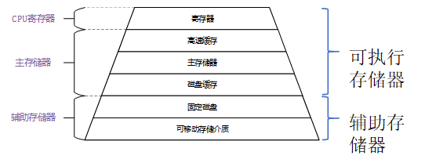

# 操作系统原理

**目录**

- [操作系统的概念](#操作系统的概念)  
- [技术详解](#技术详解)  
- [CPU技术概念](#cpu技术概念)  
- [操作系统内核和运行模式](#操作系统内核和运行模式)  
- [进程](#进程)  
- [线程](#线程)  
- [处理机调度](#处理机调度)  
- [死锁(DeadLock)](#死锁deadlock)  
- [死锁预防](#死锁预防)  
- [死锁预防](#内存管理memory-management)  
- [内存分区管理](#内存分区管理)  
- [内存存储分配](#内存存储分配)  

****

## 操作系统的概念

### 操作系统定义

**操作系统(Operating System/OS)**

- 控制和管理计算机系统的**硬件和软件资源**  
- 合理地组织、调度、分配计算机的**工作与资源**  
- 为用户与其它软件提供**方便的交互接口和运行环境**  
- 是计算机系统中**最基本的系统软件**

### 操作系统特征

- **并发(Concurrence)**：两个或多个事件在同一**时间间隔**内发生  
  *与并行的区别：并行指同一时刻发生*  
- **共享(Sharing)**：系统资源供多个进程共同使用  
  - **互斥共享**（如临界/独占资源）  
  - **同时访问**（宏观上，如共享资源）  
- **异步(Asynchronism)**：程序的执行速度不可预知，进程以走走停停的方式推进  
- **虚拟(Virtual)**：将物理实体转换为逻辑上的多个对应物  
  - **虚拟处理器**：多道程序并发分时  
  - **虚拟内存**：扩展逻辑内存容量  
  - **虚拟外部设备**：将单一物理设备虚拟为多个

### 操作系统发展历程

|发展阶段|操作系统类型|技术特征|
|-|-|-|
|1946年-50年代中期|手工操作阶段|脱机输入输出|
|20世纪50年代-60年代|单道批处理系统|联机批处理 → 脱机批处理|
|20世纪60年代中期|多道批处理系统|多道程序设计 → 多道批处理|
|20世纪60年代后期|分时系统|时间片轮转|
|20世纪70年代初期|实时系统|实时响应|
|20世纪70年代|通用操作系统|实时+批处理 → 分时+批处理|
|20世纪80年代初期|个人/网络/分布式系统|微机普及、网络化|
|21世纪|现代操作系统|智能化、云端融合|

****

## 技术详解

### 分时技术

**定义**：把处理机的运行时间分成很短的时间片，按时间片轮流把处理机分配给各联机作业使用。

### 各阶段特性对比

|阶段|核心特点|局限性|主要矛盾|
|-|-|-|-|
|手工操作|用户独占全机，CPU等待手工操作|资源利用率低，CPU利用不充分|人-机器矛盾|
|联机批处理|监督程序(Monitor)负责作业调度|主机与I/O设备速度不匹配|主机-输入/输出机矛盾|
|多道批处理|宏观并行/微观串行，资源利用率高|用户响应时间长，无交互|人-主机矛盾|
|分时系统|多路性、交互性、独立性、及时性|实时性相对较差|-|

### 实时系统特性

|特点|核心功能|适用场景|
|-|-|-|
|及时性、高可靠性|高精度时钟管理、可剥夺任务调度、多级中断机制|单片机、PLC等嵌入式系统|

****

## CPU技术概念

### 基本概念

- **指令(Instruction)**：CPU执行的基本操作命令  
- **指令集(Instruction Set)**：CPU能够识别和执行的所有指令的集合  
- **精简指令集RISC**：(Reduced Instruction Set Computing)  
- **复杂指令集CISC**：(Complex Instruction Set Computing)

### CPU时间周期层次结构

|时间单位|定义|关系说明|
|-|-|-|
|**时钟周期**|CPU晶振工作频率的倒数，最小时间单位|基础时间单位|
|**机器周期/CPU周期**|完成一个基本操作所需的时间|= 多个时钟周期|
|**状态周期**|机器周期内的子状态时间|1机器周期 = 6状态周期 = 12时钟周期|
|**指令周期**|取出并执行一条指令的时间|= N × 机器周期|
|**总线周期**|通过总线完成一次读写操作的时间|与机器周期相关|
|**任务周期**|完成特定任务所需的时间|= N × 指令周期|

### 补充说明

- **振荡周期**：衰减振荡中相邻同方向峰值间的时间（物理概念）  
- 各周期关系：**时钟周期 < 状态周期 < 机器周期 < 指令周期 < 任务周期**

****

## 操作系统内核和运行模式

### 核心概念

**操作系统内核**：是操作系统的核心部分，负责管理系统资源、提供核心服务。  

**中断请求**：当主程序运行到断点时，会执行一系列操作保存当前状态，随后转去执行中断处理程序，处理完成后返回断点继续执行。  

### 权限级别

- **特权指令(Privileged Instructions)**：权限最高，直接操作硬件，仅内核态可执行  
- **非特权指令(Non-Privileged Instructions)**：用户程序可执行，用于基本运算处理

- **用户态(User Mode)**：用户程序运行的模式，权限受限  
- **内核态(Kernel Mode)**：操作系统内核运行的模式，拥有最高权限

### 软件设计原则

- **内聚性**：模块内部各部分间联系的紧密程度，内聚性越高，模块独立性越强  
- **耦合度**：模块间相互联系和相互影响的程度，耦合度越低，模块独立性越强

****

## 进程

### 进程基础

**进程(Process)**：进程是程序的执行过程，是系统进行资源分配和调度的一个独立单位。

#### 程序执行方式对比

|执行方式|特征|说明|
|-|-|-|
|**顺序执行**|顺序性、封闭性、可再现性|严格按时间顺序依次进行|
|**并发执行**|失去封闭性、间断性、结果不可再现|同一时间段内交替执行|

### 进程控制块(PCB)

**PCB(Process Control Block)**：描述进程的基本情况，记录进程运行的变化情况——**进程存在的唯一标识**

**PCB包含信息**

- **进程标识符PID**：唯一标识进程、父进程/子进程
- **处理机状态**：各类寄存器XR、PSW、IR、PC
- **进程调度信息**：进程状态、进程优先级、进程时间、事件
- **进程控制信息**：程序和数据地址、进程同步与通信机制、资源清单

### 进程通信方式

|通信方式|详细信息|特点|
|-|-|-|
|**共享存储器系统**|基于共享数据结构/共享存储区|速度快，直接读写内存，需要同步|
|**管道通信系统(PIPE)**|使用PIPE文件连接读写进程|可传送大量数据，单向，机制：互斥、同步|
|**消息传递系统**|使用通信原语发送封装消息|最广泛、高级通信，直接/间接通信|
|**客户机-服务器系统**|套接字socket、远程过程调用RPC|基于文件/网络通信，本地存根+远程服务器|

****

## 线程

### 线程概念

**线程**：轻量级进程，CPU调度和分派的基本单位，进程的一个实体

### 进程vs线程对比

|维度|进程|线程|
|-|-|-|
|**资源拥有**|系统资源分配的基本单位|共享进程资源|
|**调度单位**|传统调度单位|独立调度运行|
|**系统开销**|大（需要资源分配）|小（共享资源）|
|**通信机制**|复杂（需要IPC）|简单（直接读写共享内存）|
|**组成元素**|进程ID+进程控制块PCB|线程ID+线程控制块TCB|

****

## 处理机调度

### 甘特图

**甘特图是一种用于表示进程调度过程的时间轴，横轴表示时间**

### 调度评价指标

- **资源利用率**：充分利用CPU和I/O设备
- **系统吞吐量**：单位时间完成的作业数量
- **周转时间**：作业从提交到完成的总时间
- **响应时间**：提交请求到首次产生响应的时间
- **公平性**：每个进程都要机会执行，避免饥饿

### 调度层次

1. **高级调度(作业/长程)**：按策略选择磁盘上的程序建立进程进入系统
2. **中级调度(内存/交换)**：按策略在内外存之间进行数据交换
3. **低级调度(进程/CPU/短程)**：按策略选择就绪进程，占用CPU执行

### 核心计算公式

- 到达时间 = 提交时间  
- 运行时间 = 服务时间

> **周转时间** = 完成时间 - 到达时间  
> **平均周转时间** = $\frac{\sum\limits_{i=1}^{n} \text{作业周转时间}_i}{n}$  
> **带权周转时间** = 周转时间 / 运行时间  
> **平均带权周转时间** = $\frac{\sum\limits_{i=1}^{n} \text{作业带权周转时间}_i}{n}$  
> **等待时间** = 周转时间 - 运行时间  
> **响应比** = (等待时间 + 运行时间) / 运行时间 = 1 + $\frac{等待时间}{运行时间}$  
> **可调度性检查** = $(\sum(执行时间/周期时间)) <= 1$  
> **松弛度** = 截止时间 - 当前时间 - 剩余执行时间 (**松弛度**为0时代表任务必须立即执行)

### 调度算法总览

|算法名称|算法全名|算法介绍|算法特点|抢占|
|-|-|-|-|-|
|**先来先服务**|FCFS(First Come First Served)|按照进程到达就绪队列的时间顺序|实现简单，公平性好，长作业有利|F|
|**短作业优先**|SJF(Shortest Job First)|选择预估运行时间最短的进程优先执行|降低平均等待时间，长作业不利|F|
|**最短剩余时间**|SRTF(Shortest Remaining Time First)|SJF的抢占式版本，优先剩余执行时间最短|平均等待时间低，开销大，切换频繁|T|
|**优先级**|Priority Scheduling|优先级高的进程先执行|易饥饿，可能产生优先级反转|-|
|**时间片轮转**|RR(Round Robin)|按队列顺序依次调度，分配固定时间片|公平性好，响应时间短，时间片敏感|T|
|**多级队列**|Multilevel Queue Scheduling|按优先级或类型分成不同队列|不同进程类别专门优化，灵活性高|-|
|**多级反馈队列**|Multilevel Feedback Queue Scheduling|结合多级队列与时间片轮转|综合处理各种类型，兼顾响应与吞吐|T|
|**最高响应比优先**|HRRN(Highest Response Ratio Next)|响应比最高的进程优先执行|兼顾长作业与短作业，无需精确预测|F|
|**最早截止时间优先**|EDF(Earliest Deadline First)|选择绝对截止时间早的任务优先执行|理论最优，动态优先级|T|
|**最低松弛度优先**|LLF(Least Laxity First)|选择松弛度最小的任务优先执行|最优，计算开销大|T|

### 算法选择策略

- **交互式系统**：RR、多级反馈队列（侧重响应时间）
- **批处理系统**：FCFS、SJF、HRRN（侧重吞吐量）  
- **实时系统**：EDF、LLF（保证时限）
- **通用系统**：优先级调度、多级队列（平衡多种需求）

### 关键术语

|术语|核心解释|
|-|-|
|**护航效应**|长进程阻塞后续短进程，导致平均等待时间增加。|
|**饥饿(Starvation)**|进程由于调度策略长期得不到资源。**单进程即可引起**。|
|**降级规则**|在多级反馈队列中，进程用完时间片未完成则**降级到低优先级队列**。|
|**处理机调度的三个核心性能指标**|**周转时间**、**带权周转时间**、**等待时间**。|
|**老化(Aging)**|一种防止饥饿的动态优先级调整方法，通过**提升长等待进程的优先级**来实现。|

### 优先级设置原则

> **系统进程 > 用户进程**  
> **I/O密集型 > CPU密集型**  
> **交互进程 > 批处理进程**  
> **资源要求少 > 资源要求多**

### 优先级类型

- **静态优先级**：进程创建时确定，运行过程中不变
- **动态优先级**：根据等待时间、已执行时间、进程类型动态调整

### 关键考点整理

1. **先来先服务调度算法有利于CPU繁忙型的作业，而不利于I/O繁忙型的作业。**
    * **解析**：FCFS是非抢占式算法。CPU繁忙型作业需要大量计算，很少进行I/O，一旦获得CPU就能长期占用直至完成，因此受益。而I/O繁忙型作业频繁执行I/O导致其频繁主动让出CPU，每次完成后都需重新排队，在长作业后长时间等待，因此极其不利。
2. 分时操作系统通常采用时间片轮转(RR)调度算法来为用户服务。
    * **解析**：分时操作系统需要同时满足多个用户的需要，因此把处理器时间轮流分配给多个用户作业使用。即采用RR
3. 在设计多级反馈队列调度算法时需要考虑的因素有：就绪队列的数量、就绪队列的优先级、各就绪队列的调度算法、进程在就绪队列间的迁移条件。
    * **解析**：这是多级反馈队列算法的四个核心设计参数。掌握它们就掌握了该算法的运作机制，属于必须记忆的核心概念。
4. 时间片过小将导致进程切换开销增大。
    * **解析**：时间片过小会导致进程切换非常频繁，系统需要频繁保存和恢复进程上下文，增加了系统开销，降低了CPU利用率
5. 优先级继承协议主要解决优先级倒置问题。
    * **解析**：当高优先级进程被低优先级进程阻塞时，低优先级进程暂时继承高优先级，避免中等优先级进程插入而延长阻塞时间
6. EDF算法对于周期性任务，当CPU利用率不超过100%时，可以保证所有任务满足截止时间要求。

****

## 死锁(DeadLock)

### 死锁

- **定义**：多个进程因竞争资源而造成的一种僵局(互相等待)，若无外力作用，这些进程都将无法向前推进
- **严格定义**：如果一组进程中的每一个进程都在等待仅由该组进程中的**其它进程**才能引发的事件(通常是释放资源)，那么该组进程就处于死锁状态
- **补充**：时钟属于外部因素。若程序包含超时设计从而脱离死锁，属于依靠外力脱离的死锁状态。 *(此处的“超时”机制实质是通过 **破坏“不可剥夺”条件** 来预防或解除死锁)*

### 死锁的特征

- 参与进程数量 >= 2
- **进程状态** - **所有相关进程因请求资源而被阻塞**
- **资源占有** - **存在“持有并等待”的局面**
- 等待关系 - 循环等待

### 死锁产生的必要条件(四个条件缺一不可)

|条件|名称|类型|详情|
|-|-|-|-|
|互斥条件|Mutual Exclusion|基础|资源是独占且排它使用，一个资源同一时间只能有一个**进程**使用|
|**不可剥夺条件**|**No Preemption**|中间行为|进程所获得的资源在未使用完毕之前**不能被系统强行夺走**，只能由进程**自身主动释放** |
|请求并保持条件|Hold and Wait|中间行为|进程已经**占有**了至少一个资源，又提出新的资源请求**且该请求被阻塞**，但**已占有的资源不释放** |
|循环等待条件|Circular Wait|表现|存在一个“进程-资源”的**环形等待链** |

### 活锁(LiveLock)

- **定义**：进程**并未被阻塞**（处于就绪或执行状态），但通过相互间的**持续协作或让步**，导致整体无法取得任何进展。

****

## 死锁预防

**核心思路：破坏死锁产生的四个必要条件中的一个或多个**

### 破坏请求并保持条件

- 进程运行前一次性申请所有需要的资源
- 系统要么全部分配，要么一个都不分配 VS 先分配但用完要释放再请求

### 破坏不可剥夺条件

- 允许进程的资源被抢占
- 进程请求新资源得不到满足时，必须释放已有资源，以后需要时再重新申请

### 破坏循环等待条件

- 资源有序分配法：给所有资源类型编号，进程必须按递增的顺序请求，已占有大编号不能再请求小编号资源

### 死锁避免

- 安全状态：能找到一个序列，让所有进程顺利完成，如果没有则可能导致死锁
- 核心策略：分配资源前先检查，如果分配后系统仍安全 → 分配，否则不分配

### 死锁解除

**核心原则：最小代价**  
**注意：防止总是选择同一个进程**

- 进程优先级：低
- 已执行时间：短
- 还需时间：长
- 已用资源：少
- 进程性质：批处理>交互式

### 死锁检测

**死锁定理**：如果资源分配图能完全简化（所有边都消去）→ 没有死锁

****

## 内存管理(Memory Management)

### 存储管理的功能和任务

- **内存的分配与回收**：记录内存使用状态、按需分配空间、程序结束后回收
- **地址转换**：逻辑地址物理地址、保证程序正确执行
- **内存扩充**：虚拟存储技术、自动覆盖技术
- **存储保护**：地址越界保护、权限保护
- **内存共享**：多个进程共享代码或数据

### 内存地址

**逻辑地址(相对地址)**：Logic Address Space
- 程序员编程时使用的地址
- 从0开始编号
- 与程序在内存中的实际位置无关

**物理地址(绝对地址)**：Physical Address Space
- 内存单元的真实地址
- 程序实际存放的位置
- CPU访问内存时使用

### 地址转换

**物理地址 = 基地址 + 逻辑地址**

### 内存管理基本概念

**链接(Linking)**
- 将多个目标模块和库函数组合成一个完整的可执行程序
- 静态链接、装入时动态链接、运行时动态链接

**装入(Loading)**
- **绝对装入Absolute**：装入内存物理地址
- **可重定位装入(静态重定位)Relocation**：装入时转换为物理地址，不能移动
- **动态运行时装入(动态重定位)**：内存访问时转换，重定位寄存器

****

## 内存分区管理

**连续分配存储管理方式**
- 为用户程序分配一个连续的内存空间
- 单一连续分配、固定分区分配、动态分区分配和动态重定位分区分配

### 单一连续分配

**思想**
- 内存分为系统区和用户区
- 用户区只能装入一个程序
- 该程序独占整个用户区

### 固定分区分配

**思想**
- 将用户区预先划分成若干个固定大小的分区
- 每个分区装入一个作业
- 分区大小和数量在系统启动时确定，运行期间不变

**内部碎片**
- 分配给作业的空间中，未被利用的部分
- 内部碎片无法被其他作业使用

### 动态分区分配

**思想**
- 不预先划分分区
- 在作业装入时，根据作业大小动态划分分区
- 分区大小和数量随作业的装入和撤离动态变化

**空闲分区表：记录各分区的使用情况**

**空闲分区链**
- 用链表将所有空闲分区链接起来
- **每个节点包含**：起始地址、大小、指向下一个空闲分区的指针
- 使用后0 → 1

**外部碎片**
- 内存中存在多个不连续的小空闲分区，单个分区太小无法装入作业，但总和够
- 多次分配后产生

### 动态分区分配算法

**首次适应算法FF(First Fit)**
- 空闲分区按地址递增顺序排列
- 从链首开始查找，找到第一个大小足够的分区

**循环首次适应算法NF(Next Fit)**
- 从上次分配的位置开始查找，找到第一个大小足够的分区
- 查找到链尾后，再从链首继续

**最佳适应算法BF(Best Fit)**：空闲分区按大小递增顺序排列，找到能满足要求的最小分区

**最坏适应算法WF(Worst Fit)**：空闲分区按大小递减顺序排列，总是选择最大的空闲分区

****

## 内存存储分配

**分配内存**：利用某种分配算法，从空闲分区链表中找到所需大小的分区  
**回收内存**：合并相邻空闲分区，避免产生多个小碎片，回收并修改空闲表

**紧凑技术(Compaction)**
- 移动内存中的作业，使分散的空闲分区合并成一个大分区，解决外部碎片
- 紧凑会移动作业在内存中的物理位置，必须依赖动态重定位
- 修改重定位寄存器的值

**非连续分配管理方式基本思想**
- 允许一个程序分散地装入不相邻的内存分区
- 分页存储管理、分段存储管理和段页式存储管理

**逻辑地址的计算**

> 页号 P = 逻辑地址 A / L（取整数部分）  
> 页内偏移量 W = 逻辑地址 A % L（取余数）

### 分页存储管理方式

**页表**
- 每个进程建立一张页表，记录每个页面对应的物理块号
- 页表是逻辑页面到物理块的映射表

**地址变换机构**
- 逻辑地址转换成物理地址
- 页表寄存器PTR：存放当前进程的页表起始地址和页表长度，进程切换更新

**页表项**：页表中的一行，记录一个页面的信息

**页表长度**：页表中有多少个页表项(进程有多少页)

**页表项长度**：每个页表项占多少字节

**页面(Page)**
- 进程的逻辑地址空间划分成若干大小相等的片，每片为页/页面
- 页面从0开始编号

**页框/物理块(Frame)**
- 内存物理空间划分成与页面大小相等的块，每块为页框/物理块
- 页框从0开始编号

**快表TLB(Translation Lookaside Buffer)**
- 高速缓冲存储器，又称联想寄存器、相联存储器
- 存放当前访问的若干页表项
- 具有并行查找能力，查找速度极快

**两级页表/多级页表**：解决页表过大的问题，将页表再分页

**有效访问时间计算**

> 有效访问时间 = 快表查找时间 λ + (2 - 命中率 a)×内存访问时间 t

**反置页表**
- 页表大小与物理内存大小成正比
- 系统中只有一张反置页表，以物理块号为索引

### 分段存储

**分段存储的基本思想**：按照程序的逻辑结构划分段，每段有明确的逻辑意义，段的大小可以不相等

**优点**
**方便编程**：按逻辑模块编写  
**信息共享**：多个进程共享一段  
**信息保护**：不同段不同权限  
**动态链接**：运行时链接  
**动态增长**：数据段

**段(Segment)**
- 是按照程序的逻辑结构划分的程序单位
- 每个段有段名(或段号)和段长
- 不同段的长度可以不相等

**段表(Segment Table)**：记录每个段在内存中的位置和长度

**段号**：段的标识

**段长**：该段的长度(用于越界检查)

**基址**：该段在内存中的起始地址

**地址变换机构**
**段表寄存器STR**：段表起始地址+段表长度

*本文档整理自操作系统学习笔记，持续更新中...*