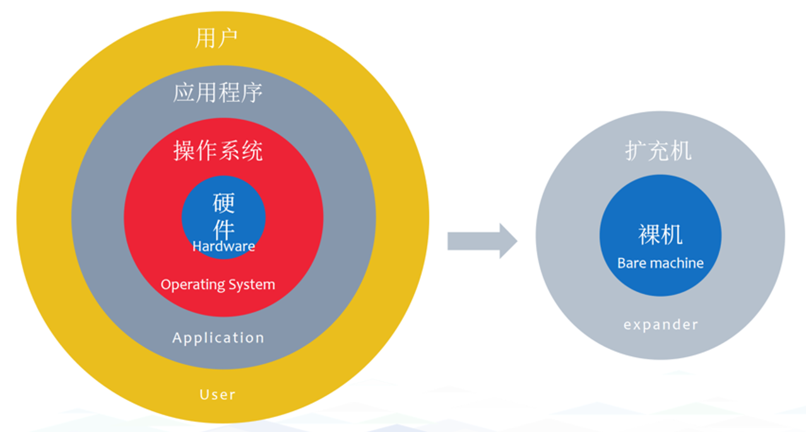
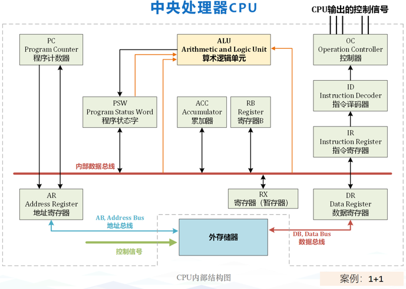
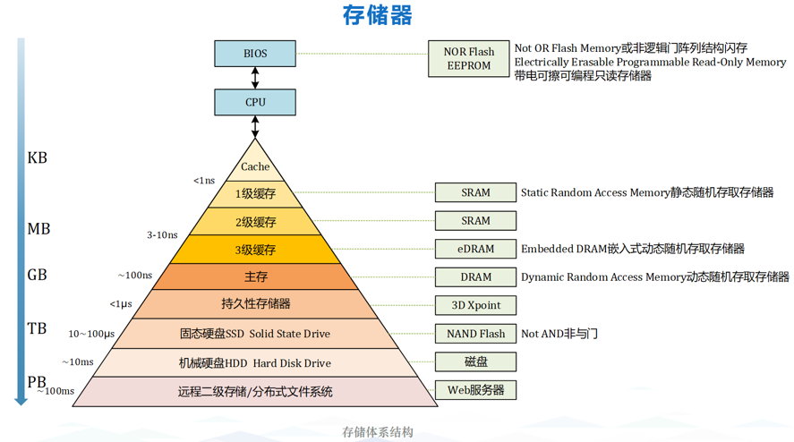
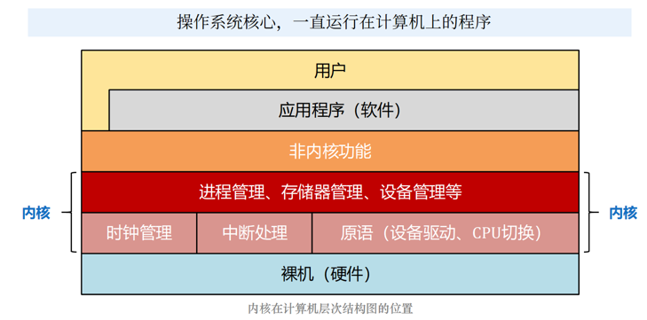
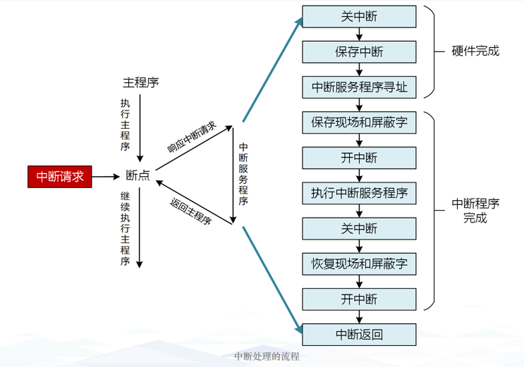
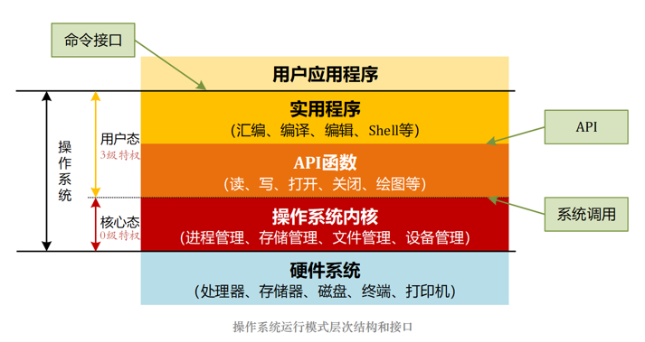
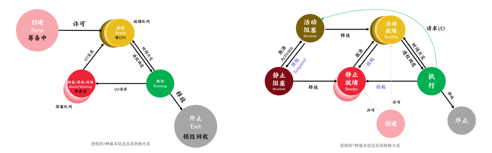

# 操作系统原理

****

## 操作系统的概念

### 操作系统定义
**操作系统(Operating System/OS)**  
- 控制和管理计算机系统的**硬件和软件资源**  
- 合理地组织、调度、分配计算机的**工作与资源**  
- 为用户与其它软件提供**方便的交互接口和运行环境**  
- 是计算机系统中**最基本的系统软件**  

### 操作系统特征
- **并发(Concurrence)**：两个或多个事件在同一**时间间隔**内发生  
  *与并行的区别：并行指同一时刻发生*  
- **共享(Sharing)**：系统资源供多个进程共同使用  
  - **互斥共享**（如临界/独占资源）  
  - **同时访问**（宏观上，如共享资源）  
- **异步(Asynchronism)**：程序的执行速度不可预知，进程以走走停停的方式推进  
- **虚拟(Virtual)**：将物理实体转换为逻辑上的多个对应物  
  - **虚拟处理器**：多道程序并发分时  
  - **虚拟内存**：扩展逻辑内存容量  
  - **虚拟外部设备**：将单一物理设备虚拟为多个  

### 操作系统发展历程
|发展阶段|操作系统类型|技术特征|
|-|-|-|
|1946年-50年代中期|手工操作阶段|脱机输入输出|
|20世纪50年代-60年代|单道批处理系统|联机批处理 → 脱机批处理|
|20世纪60年代中期|多道批处理系统|多道程序设计 → 多道批处理|
|20世纪60年代后期|分时系统|时间片轮转|
|20世纪70年代初期|实时系统|实时响应|
|20世纪70年代|通用操作系统|实时+批处理 → 分时+批处理|
|20世纪80年代初期|个人/网络/分布式系统|微机普及、网络化|
|21世纪|现代操作系统|智能化、云端融合|

****

## 技术详解

### 分时技术
**定义**：把处理机的运行时间分成很短的时间片，按时间片轮流把处理机分配给各联机作业使用。

### 各阶段特性对比
|阶段|核心特点|局限性|主要矛盾|
|-|-|-|-|
|手工操作|用户独占全机，CPU等待手工操作|资源利用率低，CPU利用不充分|人-机器矛盾|
|联机批处理|监督程序(Monitor)负责作业调度|主机与I/O设备速度不匹配|主机-输入/输出机矛盾|
|多道批处理|宏观并行/微观串行，资源利用率高|用户响应时间长，无交互|人-主机矛盾|
|分时系统|多路性、交互性、独立性、及时性|实时性相对较差|-|

### 实时系统特性
|特点|核心功能|适用场景|
|-|-|-|
|及时性、高可靠性|高精度时钟管理、可剥夺任务调度、多级中断机制|单片机、PLC等嵌入式系统|

****

## CPU技术概念

### 基本概念
- **指令(Instruction)**：CPU执行的基本操作命令  
- **指令集(Instruction Set)**：CPU能够识别和执行的所有指令的集合  
- **精简指令集RISC**：(Reduced Instruction Set Computing)  
- **复杂指令集CISC**：(Complex Instruction Set Computing)  

### CPU时间周期层次结构
|时间单位|定义|关系说明|
|-|-|-|
|**时钟周期**|CPU晶振工作频率的倒数，最小时间单位|基础时间单位|
|**机器周期/CPU周期**|完成一个基本操作所需的时间|= 多个时钟周期|
|**状态周期**|机器周期内的子状态时间|1机器周期 = 6状态周期 = 12时钟周期|
|**指令周期**|取出并执行一条指令的时间|= N × 机器周期|
|**总线周期**|通过总线完成一次读写操作的时间|与机器周期相关|
|**任务周期**|完成特定任务所需的时间|= N × 指令周期|

### 补充说明
- **振荡周期**：衰减振荡中相邻同方向峰值间的时间（物理概念）  
- 各周期关系：**时钟周期 < 状态周期 < 机器周期 < 指令周期 < 任务周期**

****

## 操作系统内核和运行模式

### 核心概念
**操作系统内核**：是操作系统的核心部分，负责管理系统资源、提供核心服务。  

**中断请求**：当主程序运行到断点时，会执行一系列操作保存当前状态，随后转去执行中断处理程序，处理完成后返回断点继续执行。  

### 权限级别
- **特权指令(Privileged Instructions)**：权限最高，直接操作硬件，仅内核态可执行  
- **非特权指令(Non-Privileged Instructions)**：用户程序可执行，用于基本运算处理  

- **用户态(User Mode)**：用户程序运行的模式，权限受限  
- **内核态(Kernel Mode)**：操作系统内核运行的模式，拥有最高权限  

### 软件设计原则
- **内聚性**：模块内部各部分间联系的紧密程度，内聚性越高，模块独立性越强  
- **耦合度**：模块间相互联系和相互影响的程度，耦合度越低，模块独立性越强  

****

## 进程管理

### 进程基础
**进程(Process)**：进程是程序的执行过程，是系统进行资源分配和调度的一个独立单位。

**程序执行方式对比**
|执行方式|特征|说明|
|-|-|-|
|**顺序执行**|顺序性、封闭性、可再现性|严格按时间顺序依次进行|
|**并发执行**|失去封闭性、间断性、结果不可再现|同一时间段内交替执行|

### 进程控制块(PCB)
**PCB(Process Control Block)**：描述进程的基本情况，记录进程运行的变化情况——**进程存在的唯一标识**

**PCB包含信息**
- **进程标识符PID**：唯一标识进程、父进程/子进程
- **处理机状态**：各类寄存器XR、PSW、IR、PC
- **进程调度信息**：进程状态、进程优先级、进程时间、事件
- **进程控制信息**：程序和数据地址、进程同步与通信机制、资源清单

### 进程通信方式
|通信方式|详细信息|特点|
|-|-|-|
|**共享存储器系统**|基于共享数据结构/共享存储区|速度快，直接读写内存，需要同步|
|**管道通信系统(PIPE)**|使用PIPE文件连接读写进程|可传送大量数据，单向，机制：互斥、同步|
|**消息传递系统**|使用通信原语发送封装消息|最广泛、高级通信，直接/间接通信|
|**客户机-服务器系统**|套接字socket、远程过程调用RPC|基于文件/网络通信，本地存根+远程服务器|

****

## 线程

### 线程概念
**线程**：轻量级进程，CPU调度和分派的基本单位，进程的一个实体

### 进程vs线程对比
|维度|进程|线程|
|-|-|-|
|**资源拥有**|系统资源分配的基本单位|共享进程资源|
|**调度单位**|传统调度单位|独立调度运行|
|**系统开销**|大（需要资源分配）|小（共享资源）|
|**通信机制**|复杂（需要IPC）|简单（直接读写共享内存）|
|**组成元素**|进程ID+进程控制块PCB|线程ID+线程控制块TCB|

****

## 处理机调度

### 调度评价指标
- **资源利用率**：充分利用CPU和I/O设备
- **系统吞吐量**：单位时间完成的作业数量
- **周转时间**：作业从提交到完成的总时间
- **响应时间**：提交请求到首次产生响应的时间
- **公平性**：每个进程都要机会执行，避免饥饿

### 调度层次
1. **高级调度(作业/长程)**：按策略选择磁盘上的程序建立进程进入系统
2. **中级调度(内存/交换)**：按策略在内外存之间进行数据交换
3. **低级调度(进程/CPU/短程)**：按策略选择就绪进程，占用CPU执行

### 核心计算公式
>**周转时间** = 完成时间 - 提交时间  
>**平均周转时间** = $\frac{\sum\limits_{i=1}^{n} \text{作业周转时间}_i}{n}$  
>**带权周转时间** = 周转时间 / 运行时间  
>**平均带权周转时间** = $\frac{\sum\limits_{i=1}^{n} \text{作业带权周转时间}_i}{n}$  
>**等待时间** = 周转时间 - 运行时间  
>**响应比** = (等待时间 + 服务时间) / 服务时间 = 1 + $\frac{等待时间}{服务时间}$  
>**可调度性检查** = $(\sum(执行时间/周期时间)) <= 1$  
>**松弛度** = 截止时间 - 当前时间 - 剩余执行时间  

### 调度算法总览
|算法名称|算法全名|算法介绍|算法特点|抢占|
|-|-|-|-|-|
|**先来先服务**|FCFS(First Come First Served)|按照进程到达就绪队列的时间顺序|实现简单，公平性好，长作业有利|F|
|**短作业优先**|SJF(Shortest Job First)|选择预估运行时间最短的进程优先执行|降低平均等待时间，长作业不利|F|
|**最短剩余时间**|SRTF(Shortest Remaining Time First)|SJF的抢占式版本，优先剩余执行时间最短|平均等待时间低，开销大，切换频繁|T|
|**优先级**|Priority Scheduling|优先级高的进程先执行|易饥饿，可能产生优先级反转|-|
|**时间片轮转**|RR(Round Robin)|按队列顺序依次调度，分配固定时间片|公平性好，响应时间短，时间片敏感|T|
|**多级队列**|Multilevel Queue Scheduling|按优先级或类型分成不同队列|不同进程类别专门优化，灵活性高|-|
|**多级反馈队列**|Multilevel Feedback Queue Scheduling|结合多级队列与时间片轮转|综合处理各种类型，兼顾响应与吞吐|T|
|**最高响应比优先**|HRRN(Highest Response Ratio Next)|响应比最高的进程优先执行|兼顾长作业与短作业，无需精确预测|F|
|**最早截止时间优先**|EDF(Earliest Deadline First)|选择绝对截止时间早的任务优先执行|理论最优，动态优先级|T|
|**最低松弛度优先**|LLF(Least Laxity First)|选择松弛度最小的任务优先执行|最优，计算开销大|T|

### 算法选择策略
- **交互式系统**：RR、多级反馈队列（侧重响应时间）
- **批处理系统**：FCFS、SJF、HRRN（侧重吞吐量）  
- **实时系统**：EDF、LLF（保证时限）
- **通用系统**：优先级调度、多级队列（平衡多种需求）

### 关键术语
- **护航效应**：长进程阻塞后续短进程
- **饥饿**：进程迟迟得不到资源
- **降级规则**：进程用完时间片未完成则降级到低优先级队列

### 优先级设置原则
> **系统进程 > 用户进程**  
> **I/O密集型 > CPU密集型**  
> **交互进程 > 批处理进程**  
> **资源要求少 > 资源要求多**  

### 优先级类型
- **静态优先级**：进程创建时确定，运行过程中不变
- **动态优先级**：根据等待时间、已执行时间、进程类型动态调整

---

*本文档整理自操作系统学习笔记，持续更新中...*
